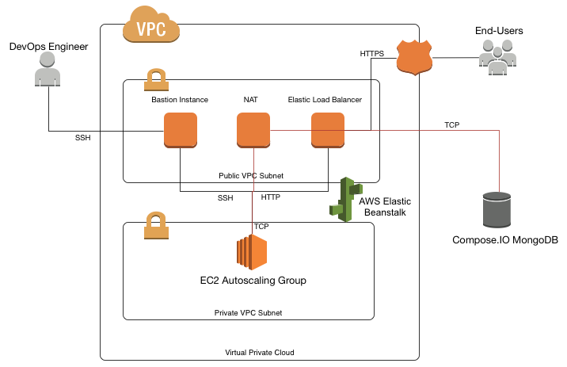

### ATS 18F Demo (Pool 2)

https://drugfax.atsid.net

**DrugFax** is the *CarFax for Drugs*, allowing consumers to understand the risks of their medication and the quality of drug manufacturers. 

### Key Features
* Users may search for drugs and view a detailed drug profile.
* Users may search for manufacturers and view their aggregate score, determined by the quantity of enforcement events associated with drugs that manufacturer produces.
* Users may save drugs that they are interested in. 
* Facebook and Twitter authentication.

## Team
 **[Chris Trevino](http://www.github.com/darthtrevino)** *Team Leader, Technical Architect*

 **[David Tittsworth](http://www.github.com/stopyoukid)** *Back-End Engineer*

 **[Brian Mathews](http://ww.github.com/bmathews)** *Front-End Engineer*

## Technology Stack

DrugFax has been written using a variety of open-source technologies. Including:
### Database
* [MongoDB](www.mongodb.org)
* [mongoose](http://mongoosejs.com/)
* [mongoose-organizer](https://www.npmjs.com/package/mongoose-organizer) (ATS Open Source)

### App-Server
* [NodeJS](https://nodejs.org/)
* [Express](expressjs.com/)
* [Passport](passportjs.org)
* [node-config](https://www.npmjs.com/package/config)
* [express-jefferson](https://www.npmjs.com/package/express-jefferson) (ATS Open Source)
* [express-mountie](https://www.npmjs.com/package/express-mountie) (ATS Open Source)

### Client Technologies
* [React](https://facebook.github.io/react/)
* [Browserify](http://browserify.org/)
* [chart.js](http://www.chartjs.org/)

### Development/Build System
* [gulp](http://gulpjs.com/)
* [nodemon](http://nodemon.io/)
* [Docker Compose](https://docs.docker.com/compose/)

### Testing
* [SuperAgent](https://github.com/visionmedia/superagent)
* [Mocha](http://mochajs.org/)
* [Chai](chaijs.com)
* [rewire](https://github.com/jhnns/rewire)
* [nock](https://github.com/pgte/nock)

ATS ❤ Open Source

## Infrastructure
DrugFax has been containerized using Docker and is hosted on AWS Elastic Beanstalk using the Beanstalk/Docker template. 
The creation of necessary infrastructure has been automated by using [AWS CloudFormation](https://aws.amazon.com/cloudformation/). 
The CloudFormation document we used to generate the live infrastructure has been provided in [cloudformation.json](https://github.com/atsid/18f-RFQ993471-POOL2/blob/master/cloudformation.json).
The database instances for the application are hosted in [compose.io](http://compose.io/), which hosted management of MongoDB and other NoSQL databases.

## Monitoring
DrugFax is monitored using NewRelic. NewRelic provides performance and availability monitoring, and can alert us to critical events using a service integration with PagerDuty.
 
## Configuration Management
We use [node-config](https://www.npmjs.com/package/config) to manage our application configuration. 
Node-Config allows you to define a default configuration object, and optional overrides per each NODE_ENV environment. 
Additionally, it provides a bridge for environment variables to be injected into the configuration object. 
We use environment variables exclusively to manage sensitive API keys and connection strings.

## Testing
The entire application has been tested using [mocha](https://github.com/mochajs/mocha), [chai](http://chaijs.com/), and [SuperAgent](https://visionmedia.github.io/superagent/). 
The client-tests use [jsdom](https://github.com/tmpvar/jsdom) to emulate DOM interactions. 
Unit testing coverage has been reported to [CodeClimate](codeclimate.com), and metrics may be viewable at the CodeClimate badge link at the top of this file.

## Development / CI Practices
We used the [Github Flow](https://guides.github.com/introduction/flow/) practice of encapsulating changes to the project as pull requests. 
This allows us to have a code review policy before code is merged into the master (stable) branch.  
We use [Wercker](wercker.com) to build the application.
Wercker supports Github Flow and provides build information with every build on every branch, this allows us some level of verification before code is merged into the stable branch.
Wercker, CodeClimate, and Github all emit WebHook events into Slack, which we have utilized as our team communication mechanism.

## Development
### Installation
#### Using Docker Compose (Recommended for Linux)
    > docker-compose build && docker-compose up
        
#### Using Vagrant (Slower Startup)
    > vagrant plugin install vagrant-docker-compose
    > vagrant up
    
### Opening the Application
* **Linux or Vagrant**: `> open http://localhost:9000/`
* **OSX via Docker Compose**: `> open http://$(boot2docker ip 2>/dev/null):9000`

